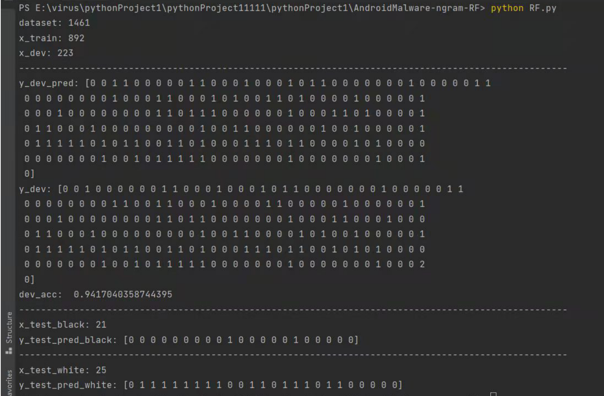

# 提取安卓恶意软件的n-gram特征,用随机森林进行分类

>参考github链接： [链接1](https://github.com/runner-china/runner-china.github.io/blob/ffa4040d5dcc234f15e51301519a1fcf0c872f4b/_posts/2016-04-05-android-malware.md) ,[链接2](https://github.com/UP1998/Software-system-security/blob/7b2baaca2cd25e794299e7fca8b3c2a68146981a/%E5%A4%A7%E4%BD%9C%E4%B8%9A/%E8%BD%AF%E4%BB%B6%E4%B8%8E%E7%B3%BB%E7%BB%9F%E5%AE%89%E5%85%A8%E5%A4%A7%E4%BD%9C%E4%B8%9A.md) [链接3](https://github.com/DQinYuan/AndroidMalwareWithN-gram.git ) 。
[参考硕士论文](https://kns.cnki.net/KCMS/detail/detail.aspx?dbcode=CMFD&dbname=CMFD201801&filename=1017090585.nh&uid=WEEvREcwSlJHSldRa1FhdXNXaEhoOHRsbkI2S2l0YWR0TGRKZWFjLy91ST0=$9A4hF_YAuvQ5obgVAqNKPCYcEjKensW4IQMovwHtwkF4VYPoHbKxJw!!&v=MDMyNTBURXFwRWJQSVI4ZVgxTHV4WVM3RGgxVDNxVHJXTTFGckNVUkxPZVp1UnJGQ25sVkx2UFZGMjZHYk94SHQ=)

## 原理

按照一定的标准将指令分为MRGITPV七类，所有的字节码到其分类的映射规则都位于/infrastructure/map.py文件中。

提取的特征是按照每种n-gram是否出现，如果出现过就为1，不出现就为0。

良性样本（类别记为1），恶意样本（类别记为0），测试（黑和白）样本（暂且类别设为2），数量分别是686:729:25:21。

检测方法框架：恶意样本/良性样本→apktool反编译→提取smali文件中的dalvik指令集→生成3-gram→使用机器学习算法训练分类器

## 软件模块

概述：batch_disasseble.py，bytecode_extract.py，n_gram.py，RF.py是4个可以直接执行的脚本，/infrastructure下的模块全部是给这些脚本提供一些封装好的基础设施，比如smali解析等等。

`batch_disasseble.py`:将恶意apk从指定目录反汇编到/smalis/malware/目录下，将良性apk从指定目录反汇编到/smalis/kind/目录下的脚本

`bytecode_extract.py`:将字节码从smali文件中提取出来并映射成其分类，最终存储到当前目录下的data.csv的脚本

`n_gram.py`:将data.csv提取n_gram特征转换成n_gram.csv的脚本

`infrastructure.map`:配置了所有字节码到MRGITPV分类的映射关系　

`infrastructure.smali`:Smali类的每个实例代表一个smali文件，用于封装解析smali文件的逻辑

`infrastructure.ware`:Ware类的实例代表一个安卓app，该类的实例会包含多个Smali实例，这些Smali实例都是从该app反汇编得到的smali文件得到的。

`RF.py`:用随机森林训练分类器

`move.py`:是一个在数据集中按百分比随机抽取的脚本

`get_num`:是方便RF定位的脚本

## 如何运行

运行环境：windows/macos/linux, pycharm, 反汇编工具apktool。

`/smalis/malware和/smalis/kind和/smalis/test`3个文件夹是存放反汇编结果的目录。

数据集路径需要自己指定，在`batch_disasseble.py`和`get_num.py`中

按照以下顺序执行命令（或者直接执行run.bat，里面写的就是这些命令）：

```
python batch_disasseble.py
python bytecode_extract.py
python n_gram.py 3
python RF.py
```
  
`python bytecode_extract.py`执行结束后会在当前目录生成一个`data.csv`，这个是在n-gram处理之前的特征，`data.csv`由SoftwareName,isMalware,Feature三个字段组成，分别代表软件名称，是否恶意软件（是为0，不是为1）和特征，其中Feature字段是该app的所有操作码（被分为了MRGITPV七类表示），其中用"|"分隔不同的method。

`python n_gram.py`后面接的参数的含义就是n-gram中的n，命令运行结束之后会在当前目录生成一个`n-gram.csv`文件，比如我用的`python n_gram.py 3`，命令执行结束后就会在当前目录生成一个`3-gram.csv`文件。

## 运行数据

`data.csv`，`3_gram.csv` 前面样本是良性样本，中间是恶意样本，最后是测试样本（为了最后准确判断预测率，我们会有白测试样本和黑测试样本）。

注：反编译时间过长，分类网络结构较小，需要考虑结构改进和使用其他反编译工具。因为基于java的反汇编工具apktool占内存较大。

通过实验比较，下面N取值3，3-gram Opcode ,使用随机森林算法，运行结果截图如下图所示。




